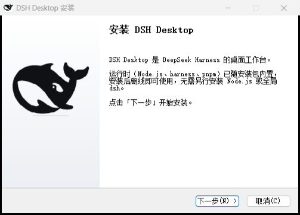

# DSH Desktop

> ## ⛔ 项目已冻结（2026-09-25）：请改用**官方桌面端**
>
> 官方已通过自己的下载通道发布桌面安装包（Windows x64，随官方 nightly 通道）：
>
> - 安装包：<https://download.deepseek.com/dsh-desk/bin/win-x64/deepseek-harness-0.1.7-rc.2-win-x64.exe>（约 288 MB）
> - 校验/清单：<https://download.deepseek.com/dsh-desk/feeds/win-x64/nightly.yml>
> - 本仓库的实测记录与结论见 [docs/OFFICIAL-DESKTOP-PIVOT.md](docs/OFFICIAL-DESKTOP-PIVOT.md)
>
> 原因：官方 0.1.7-rc.1 起，桌面客户端强制要求官方私有桌面壳提供的原生桥
> （`window.dshDesktop.keyboard` / `shortcuts`，见 [docs/DESIGN.md](docs/DESIGN.md) D51）。
> 自研壳要跟就得复刻一套不公开的私有契约，成本与风险都不划算；官方既然已经出包，就直接用官方。
>
> 本仓库停在 **v0.8.12**（随包 harness 钉在最后一个验证可用的 `0.1.7-alpha.2`，含杀软误报的结构性修复），
> 仍可安装使用；上游自动巡检已暂停，不再跟随新版本。需要"自带运行时 + 手机连接/局域网门面 + 安全模式 + 插件体检"
> 这些官方没有的能力时，可以继续用 v0.8.12。

以 [DeepSeek Harness](https://github.com/deepseek-ai/deepseek-harness) 为基底的**桌面工作台**：Electron 原生壳 + 内嵌 harness 运行时，离线、免安装 Node、免全局 dsh 即可使用。

> **自带视觉模型**：内置 `DeepSeek-V4-Flash-Vision-Exp`（`deepseek-v4-flash-vision-exp`），支持图片输入——直接把截图/图片拖进输入框，让模型看图说话、识别界面、分析图表。

---

## 设计架构

**对齐官方 [DeepSeek Harness 桌面端](https://github.com/deepseek-ai/deepseek-harness/tree/master/apps/desktop) 的运行时、插件与版本模型**：同一个绑定版本单元、同一套 profile/组合包语义、同一套官方插件系统（Web 侧边栏「插件」页 + `plugin_manager` 工具，包操作走随包 pnpm）。壳只保留桌面原生能力（窗口、托盘、深链、快捷键、通知/徽标、自动更新、局域网/浏览器版），界面是官方 Web UI 原样。

> 传输层同样是官方形态：Host 用官方 `runProfile` 起**真实 Web Host**（loopback，默认 19387），
> Electron 从 `dsh-app://app/` 加载随包 dist，其余请求带 Host 签发的 cookie 转发；
> `--no-open` 保证**启动时不会自动打开浏览器**（要看浏览器版请走托盘）。
> 逐条差距与实测数据见 [docs/OFFICIAL-ALIGNMENT-REVIEW.md](docs/OFFICIAL-ALIGNMENT-REVIEW.md)。

```
Electron 壳 ──spawn(随包 Node)──▶ dsh-desktop-host（官方 runProfile 引导 profile）
    │  ▲                              │  ▲
    │  │ Node IPC：ready{url,injections} / fatal / shutdown
    │  │ HTTP：已认证 Web Host（loopback，默认 19387；冲突时自动换随机端口）
    │  └──────────────────────────────┘
    ├── 窗口加载 dsh-app://app/ ──▶ 壳按官方桌面端分发：
    │        • 入口文档与 /assets/*  → 随包 dist（注入 __DSH_BOOT_READY__）
    │        • 其余（/api、插件 client）→ 带 Host cookie 转发（forwardWebRequest）
    │        • WebSocket 远端流      → 客户端直连 Host，壳补齐 Origin/cookie
    └── bridge 插件 WS（127.0.0.1，随机端口 + 随机 token）→ 通知/徽标/深链/工作区注册
```

### 与官方一致的几条关键决策

| 维度 | 本壳做法（= 官方做法） |
|---|---|
| 传输 | **官方形态**：Host 用 `runProfile` 起真实 Web Host（loopback，默认 19387，可用 `webserver.config.port` patch 覆盖），ready 事件带回**认证 URL** 与 **index 注入片段**；窗口从 `dsh-app://app/` 加载随包 dist（入口注入 `__DSH_BOOT_READY__`），其余请求由主进程带 cookie 转发。凭据只存在主进程，渲染层拿不到；`--no-open` 保证不自动开浏览器 |
| Web UI 远端流 | 官方 WebSocket mux：客户端连 `ws://127.0.0.1:<hostPort>`，主进程按官方方式补 `Origin`/`cookie`；局域网/浏览器版门面额外做 WS 升级代理（同样过设备授权 + token 门禁） |
| 运行时 | `extraResources` 直接随包两棵树：`resources/runtime`（**pnpm**；0.8.7 起不再随包 `node.exe`，解释器用应用自身的 Electron 二进制 `ELECTRON_RUN_AS_NODE`，与官方桌面端同形）与 `resources/dsh`（`npm install @deepseek-ai/dsh` 的完整生产闭包 + 第一方包），**不再首启解压**；`resources/dsh/desktop-runtime.json` 记录每个文件的 sha256 与发行身份（壳版本 + dsh 版本 + Electron/Node/pnpm 版本 + 协议版本），启动时校验，对不上直接拒绝启动 |
| 版本模型 | **一个签名更新单元**：壳 / dsh / Node / pnpm 由 `desktop-runtime.json` 绑死，随桌面端一起发版；不再有「单独更新 harness」的通道（历史上的整树刷新、兼容探测、tar.gz 解压与不兼容清单全部删除） |
| 插件 | **官方插件系统原样运行**：Host 向 dsh 提供官方「启动器信息」（`profileContext`，身份名 `desktop`，含随包 pnpm 作为 `packageManager`），`plugin-manager` 与 HMR 因此激活——侧边栏「插件」页与 `plugin_manager` 工具可在本壳里安装/启停/卸载。profile（`$DSH_HOME/profiles/dsh-workbench`）承载组合：`dsh.profile.bundles` 是有序启用列表，第一方包（bridge / host / dsh）以 **junction 共享包**链接进 profile `node_modules`，第三方插件由官方管理器用**随包 pnpm**装进 profile 依赖，事务期间持有 `<profile>/lock` 与 `desktop-packages-pending` 标记；安装失败按官方语义回滚 `package.json` + `pnpm-lock.yaml`，依赖脚本待批准时给出「允许并重试」。**壳只做两件对账**（都不做插件管理）：启动期把解析不出来的 bundle 条目移出启用列表（不卸载任何东西），以及在启动前体检并修复 `node_modules` 与清单的不一致（缺包/锁文件脱节 → 随包 pnpm `pnpm install`；清单未声明、pnpm 也不认的插件目录 → 清除，链接只删链接） |
| 签名 | Windows：EV 证书 + SafeNet 令牌（`signtoolOptions.sign` → `scripts/windows-sign.mjs`，未配置签名环境时显式跳过）；macOS：Developer ID 签名 + `notarytool` 公证 + stapling（`scripts/package-macos.mjs`，`resources/dsh`/`resources/runtime` 排除签名）。逐项说明见 [docs/SIGNING.md](docs/SIGNING.md) |

### 本壳相对官方的**有意差异**

- **profile 目录是 `dsh-workbench`**（官方用保留名 `desktop`）。本壳是独立应用，不占用官方保留名；首次启动会把历史 `profiles/desktop` 改名迁移。**交给官方启动器的身份名仍是官方的 `desktop`**——官方组合树里 desktop-only 的行（账号插件的 `desktopPlatform`、桌面侧边栏的浏览器标签）按它开关；目录与身份分开后，盘上不占官方目录，组合树里仍是桌面端。
- **多一个 `dsh-desktop-bridge` 插件**（第一方、随包、bundle 层加载）：官方壳用原生对话框/无托盘，本壳用系统通知、任务栏徽标、`dsh://` 深链、托盘、局域网/浏览器版，这些需要一条壳↔harness 的本地 RPC 通道。它是壳自有的、唯一额外监听 socket（127.0.0.1 随机端口 + 每次启动随机 token），不参与 harness 的 HTTP 面。
- **局域网访问 / 浏览器版**：官方没有该能力；本壳的对外门面（`src/main/lanServer.ts`）把 HTTP 与 WebSocket 升级都代理到已认证 Host，回环免授权、局域网设备需电脑确认 + 本次运行 token 换 cookie。
- **会话修复与安全模式**：官方没有；本壳保留（`src/main/sessionRepair.ts`、`src/main/safeMode.ts`）。

---

## 功能截图

> 下列截图为干净示例环境所拍，无任何个人会话、路径或密钥信息。

### 主界面（会话工作台）

左侧工作区/会话树，右侧"探索未至之境"新会话入口。模型下拉可选择自身支持的能力——包括**视觉模型**（图片输入），输入框支持把图片直接拖入或点 `+` 添加。

| 主界面（新会话） |
|---|
|  |

### 加载页面（Harness 引导中的过渡页）

窗口先显示这个过渡页，随后端（内嵌 harness 组合，约 2 秒）就绪后自动切到工作台；运行时随包分发，不解压、不联网。

| 加载页面 |
|---|
|  |

### 托盘菜单

关闭窗口默认最小化到托盘。托盘只留真正的动作与一条状态行：

```
显示工作台 / 打开浏览器版 / 手机连接（扫描二维码）… [ / 断开手机连接 ]
─── Harness：运行中 · 桥接：已连接 · 任务可用
重启 Harness / 进入安全模式（安全模式下换成「退出安全模式」）
设置 ▸ 自动更新 · 检查更新 … / 开机自启 · 系统通知 / 打开日志目录 · 清理日志 / 卸载
退出
```

> 插件管理只有一处入口：应用内左侧边栏的**「插件」页**（官方共享插件管理器）。
> 安装、启停、卸载、依赖脚本授权、pnpm 诊断都在那里；托盘不再复制一套。
>
> 托盘唯一保留的插件相关项是**「进入安全模式」**（原生恢复）：它停用全部第三方插件、
> 只留官方基线 + bridge，Host 起不来时也能把工作台救回来。会话、审批、工作区这些
> 都回到 Web UI 里操作，托盘不再展示会过期的副本。

> `docs/screenshots/托盘菜单.png` 仍是 0.8.1 的旧菜单截图（含已被移除的「桌面插件 / 切换工作区」等项），
> 0.8.2 的新菜单结构以上面的文本示意为准，截图待补。

---

## 模型与视觉能力

桌面版接入 DeepSeek 官方 API（`baseURL` 默认 `https://api.deepseek.com`，可配置），内置模型目录（`llm-deepseek` 适配器的 `DEFAULT_MODELS`）：

| 模型 ID | 名称 | 输入模态 | 说明 |
|---|---|---|---|
| `deepseek-v4-flash` | DeepSeek-V4-Flash | 文本 | 轻量、快速 |
| `deepseek-v4-pro` | DeepSeek-V4-Pro | 文本 | 推理更充分 |
| `deepseek-v4-flash-vision-exp` | **DeepSeek-V4-Flash-Vision-Exp** | 文本 + 图片 | **视觉模型**，支持图片输入 |

### 使用视觉模型

1. 在输入框模型下拉切换到 `DeepSeek-V4-Flash-Vision-Exp`（或任意标注支持图片的模型）。
2. 把图片**拖入输入框**，或点 `+` 选择本地图片。
3. 发送后模型即可基于图片内容作答（识别界面、分析截图、读图表、生成图片描述等）。

> 若当前选中模型不支持图片，界面会提示"当前模型不支持图片，请切换支持图片的模型"——切换到视觉模型即可。

### 图片约束（视觉模型）

适配器对图片输入做了安全约束（超限会明确报错）：

| 约束 | 值 | 说明 |
|---|---|---|
| 单张图片大小 | ≤ 1 MB（`DEFAULT_REQUEST_IMAGE_MAX_BYTES`） | 超出提示"单张图片不能超过 {size}" |
| 图像像素预算 | ≤ 640,000 像素（`DEFAULT_REQUEST_IMAGE_PIXEL_BUDGET`） | 超出提示"图片分辨率过大，请压缩后重试" |
| 每条消息图片数 | 有上限（各模型可配，界面提示"一条消息最多添加 {count} 张"） | — |
| 请求总体积 | ≤ 128 MB（`DEFAULT_MAX_REQUEST_FILES_BYTES`） | — |
| 支持格式 | PNG / JPG / WebP / GIF | 不支持的类型提示"仅支持 PNG、JPG、WebP、GIF" |

> 图片按"附加内容块"（attachment）经 harness 的图片预检（`inputModalities` 能力门控）后才进入请求；模型不支持图片时会在预检阶段直接拒绝，不消耗调用。

---

## 安装

1. 从 [Releases](https://github.com/Plocr/dsh-desktop/releases) 下载最新安装包（Windows：`DSH.Desktop-x.x.x-setup.exe`）
2. 双击运行，按向导完成安装（可选择安装目录）
3. 首次启动创建桌面 profile 并引导内嵌 harness（约 2 秒，无需解压、无需联网）

> 安装包自包含：内置 dsh 运行时与 pnpm（解释器用应用自身的 Electron 运行时），**无需**预先安装 Node.js 或全局 dsh。
>
> ⚠️ **杀毒软件误报**：本应用未签名，且会拉起内嵌 Node 运行时加载大量插件文件，容易被行为启发式
> （如卡巴斯基的 `PDM:Trojan.Win32.Generic`）误判并**按文件隔离**安装目录里的散件。
> 0.8.9 起 Host 入口随壳打进 `app.asar`（运行时树里那份只作兜底），被隔离也不再挡住启动；
> 0.8.6 起启动时会直接指出"哪个运行时文件缺失、很可能被安全软件隔离"，不再把它伪装成插件故障。
> 处理与自查（含逐文件对账命令）见 [docs/ANTIVIRUS-FALSE-POSITIVE.md](docs/ANTIVIRUS-FALSE-POSITIVE.md)。

### 安装向导

向导是带品牌的 NSIS 流程：欢迎页（内置运行时、离线可用）→ 安装位置 → 安装（连续进度条）→ 完成页
（可直接勾选启动）。页头与侧栏的品牌图由 `scripts/make-icons.mjs` 生成（纯 JS，无外部依赖）；
页面文案在 `scripts/installer.nsh` 里定义。

| 欢迎页 |
|---|
|  |

---

## 使用

- **开始会话**：启动后在窗口内选择工作区，即可开始对话
- **视觉模型**：模型下拉切换到 `DeepSeek-V4-Flash-Vision-Exp`，拖入图片即可看图对话（见上方"模型与视觉能力"）
- **账号登录（侧边栏左下角）**：官方账号功能原样可用——点「登录」后应用会**在应用内开一个登录窗口**加载平台授权页（链接带 `theme=`，跟随应用明暗；独立 session，所以平台的登录态可以复用），授权完成自动关窗 + 提示；加载失败/建窗失败会**自动退回系统浏览器**（想强制用浏览器：设 `DSH_DESKTOP_LOGIN_BROWSER=1`）。授权超时/失败时窗口会自动唤回前台并说明原因（网络 / 凭据存储 / 超时 / 平台拒绝）。登录后可看余额，用量/充值按钮打开平台页面；「退出登录」只清账号授权，不动你配置的 API Key。凭据只存在本机 harness 的凭据文件里，壳不接触
- **HTTPS 被安全软件扫描时也能用**：宿主进程与 pnpm 以 `--use-system-ca` 启动（用操作系统证书库），壳自己的检查走 Chromium 网络栈，所以卡巴斯基等安全软件的「加密连接扫描」不会再让登录/模型请求/插件安装失败（见 [docs/release-notes/v0.8.8.md](docs/release-notes/v0.8.8.md)）
- **全局唤出**：任意界面按 `Ctrl+Shift+Space` 呼出/隐藏窗口
- **深链**：浏览器或其他应用点击 `dsh://` 链接可唤起并打开对应会话
- **托盘**：关闭窗口默认最小化到托盘；右键托盘图标可看一行状态（Harness · 桥接）、打开浏览器版、手机连接（二维码）、重启 Harness、进入/退出安全模式、设置（更新 / 自启 / 通知 / 日志 / 卸载）
- **会话共享**：桌面版默认使用**独立数据目录**（`%APPDATA%/DSH Desktop/dsh-home`，即 Electron `userData` 下），并与 Web/CLI 并存互不冲突；首次启动会自动把旧的 `~/.dsh` 迁移过去，原数据保留。
- **手机连接（扫描二维码）**：托盘点「手机连接（扫描二维码）…」会按需开启壳自带的对外门面（绑 `0.0.0.0:46123`，固定端口被占则自动换随机端口），并弹出二维码窗口；**手机相机扫码即在浏览器里打开本工作台**（地址带本次运行的一次性令牌）。手机首次访问时**电脑会弹授权框**（按设备 IP 记一次，本次运行有效）：允许才放行，拒绝返回 403。⚠️ 允许后该设备可在浏览器中操作本工作台（可读文件/执行命令），建议仅在可信网络使用；「断开手机连接」或在托盘菜单关闭后立即停止对外服务。

---

## 隐私说明

- **数据本地化**：会话、工作区、设置均保存在本机（默认 `%APPDATA%/DSH Desktop/dsh-home` 下的独立数据目录），不与 Web/CLI 冲突，也不会自动上传。
- **API 凭据**：DeepSeek API Key 通过配置的凭据存储（或在环境变量 `DEEPSEEK_API_KEY`）提供给 harness，仅在发起模型请求时使用；桌面壳本身不保存密钥明文到会话。
- **网络边界**：默认仅回环监听（`127.0.0.1`）；只有点了「手机连接（扫描二维码）」才会开启对外门面（`0.0.0.0`，端口被占自动回退随机端口），且其它设备首次访问必须在本机授权。断开手机连接后立即停止对外服务。
- **更新元数据**：更新检查只访问 npm registry / GitHub Releases 拉取版本与安装包，不包含你的会话内容。
- **截图示例**：本仓库 `docs/screenshots` 的界面截图为干净示例环境拍摄，经确认不含个人会话正文、本地路径或密钥。

---

## 更新机制

**一条链路：框架更新（本应用）**，它同时带走随包运行时。术语：**框架** = DSH Desktop 本体；**官方 Harness** = DeepSeek Harness（`@deepseek-ai/dsh`）。

- 源：GitHub Releases（[Plocr/dsh-desktop](https://github.com/Plocr/dsh-desktop/releases)）
- **本地下载，不跳浏览器**：electron-updater `autoDownload`；下载全程右上角卡片实时进度 + 任务栏进度条
- **下载完成 → 点「安装更新并重启」按钮（或系统通知）→ 确认后退出并安装**，安装完自动重启；
  若下载完没点安装就退出，下次启动仍会重新提示（跨重启保留，不会丢）
- 通知内附两个下载地址：GitHub 官方地址 + **免费加速代理地址**（默认 `ghfast.top`，可用环境变量 `DSH_DESKTOP_GH_PROXY` 覆盖）

> **为什么没有"单独更新官方 Harness"的通道**：壳版本 + dsh 版本 + Electron（harness 的解释器）+ pnpm + Host 协议版本被打包成一个
> **签名更新单元**，写进随包 `resources/dsh/desktop-runtime.json`（逐文件 sha256），启动时校验；对不上直接拒绝启动。
> 历史版本里那套「应用内检测 npm 版本 → 整树替换 → 兼容性闸门 → 不兼容清单」已全部移除。
> 这么做换来的是：不存在"壳与运行时半新半旧"的组合，任何一方的行为差异都不会变成用户侧的偶发故障；
> 代价是 harness 只能跟着框架一起升级（要更新的 dsh 请等框架发版）。
> 相关环境变量（仅打包时用，见 `scripts/setup-runtime.mjs`）：`DSH_RUNTIME_DSH_VERSION`（默认 npm 上最新的可用版）、
> `DSH_RUNTIME_NODE_VERSION`、`DSH_RUNTIME_NODE_ARCH`。

### 官方 Harness 更新怎么进到桌面端（不需要服务器）

桌面端**不会**自己去 npm 拉新版 harness——版本是绑定的（见上一段）。但"监测官方更新 → 拉取 → 构建安装包"
这条链路可以完全托管给 **GitHub Actions**（免费额度足够，不需要你自建服务器）：

| 方式 | 怎么做 | 结果 |
|---|---|---|
| 手动 | `npm run upstream:dsh:check`（只报告）→ `npm run upstream:dsh -- --sync --write` → `npm run setup:runtime` → `npm run check` + `npm run e2e:bridge` → 打 tag | 本地一条龙 |
| 自动（默认） | `.github/workflows/upstream-dsh.yml` 每天 04:00（Asia/Shanghai）自动跑，或手动触发（`publish` 默认勾选） | 检测到新版 → 同步 pin、重建运行时、跑门禁与 e2e → 全绿后写更新日志、推默认分支 + 打 `v<壳版本>` tag → 触发 `build-release.yml` 三平台出包并发布 Release → 已装用户自动更新（**Windows**；macOS 需签名分支产出 zip 才支持应用内更新，否则应用内会明确提示去 Release 页手动下载 dmg） |
| 只审不发（可选） | 手动触发同一 workflow 并**取消勾选** `publish` | 只推 `upstream/dsh-<版本>` 分支 + 开 PR，等你 review 后自己打 tag |

**更新日志**：自动出包时会写一份 `docs/release-notes/v<壳版本>.md` 并随代码提交，正文开头就是
"跟随官方最新 harness 同步：`@deepseek-ai/dsh` 旧版本 → 新版本"；`build-release.yml` 用它作为 Release 正文
（没有对应文件时回退 GitHub 自动生成）。也就是说用户在应用里点「检查更新」看到的版本说明就是这一份。

两个必须知道的细节：

1. **不能看 npm 的 `latest` tag**。实测 `@deepseek-ai/dsh` 的 `latest` 指向 `0.1.5-rc.2`，而最高版本是
   `0.1.6-alpha.2`——巡检脚本比的是**版本列表里的最大值**（复用壳自己的版本比较函数）。
2. **每次都得同时升壳版本**。electron-updater 只接受更高的应用版本；只改 dsh pin 而壳版本不动，
   已装用户收不到更新。脚本会自动把壳版本 patch+1。

自动化只处理版本号：官方组合树或宿主 API 有破坏性变化时，CI 里的 e2e 会失败（**不会**发出坏包），
那种情况需要人工改 `packages/host` / `packages/bridge` 源码；IPC 契约变了才需要手动 +1
`DESKTOP_HOST_PROTOCOL_VERSION`（在 `src/main/hostProcess.ts` 与 `scripts/setup-runtime.mjs` 两处）。

**入口（托盘 → 设置）：**

- `自动更新（框架 v… · 官方 Harness v…）`（开关，默认开）：冷启动自动检查并下载一次；关闭则仅手动
- `检查更新…`（动作）：检查框架更新，有新版自动本地下载；下载完成后需点「安装更新并重启」按钮确认安装（Windows 为静默安装 + 自动重启）。macOS 上若该版本没提供 zip 更新包（未签名构建即如此），应用会直接说明「请手动下载安装」，不会假装在下载

**托盘状态行（一行，排障用）：**

- `Harness：运行中 · 桥接：已连接 · 任务可用`：Host 进程状态 + 壳 ↔ harness 的桥接通道状态（插件 `bridge.diag` 上报）；
  出现 `未连接`、`任务不可用`、`⚠ 协议不匹配`、`⚠ 版本未知` 时，通知/徽标/深链会相应降级，日志里有 `bridge diag(...)` 明细
- 后台任务数、待审批、最近会话（`sessions.changed` 增量）仍在**界面内**与系统通知里体现，不再占用托盘行

## 开发 / 构建

前置：Node ≥ 22。以下命令均在仓库根目录执行。

```bash
npm install            # 安装开发依赖（shell 侧；运行时依赖由 setup:runtime 单独安装）
npm run dev            # 开发模式（隔离 userData，与已安装版并行）
npm run check          # typecheck + 单测（npm run typecheck && npm test）
npm test               # 单元测试
```

**构建安装包**（运行时自包含，首次构建会下载便携 Node 并安装 450+ 依赖，耗时较长）：

```bash
npm run dist:win          # Windows NSIS 安装包（主平台，实测）
npm run dist:win:portable # Windows 便携版
npm run dist:mac          # macOS dmg（需在 macOS 上执行，arm64/x64）
```

- `scripts/build.mjs`：esbuild 打包 main/preload → `dist/`
- `scripts/make-icons.mjs`：生成应用图标（png / ico / icns）
- `scripts/setup-runtime.mjs`：构建随包运行时两棵树——`resources/runtime`（pnpm；**不含 `node.exe`**）与 `resources/dsh`（`npm install @deepseek-ai/dsh` + 第一方包 tgz + `desktop-runtime.json` 逐文件 sha256 清单）；源码哈希未变时秒过不联网。构建期会临时下载一份便携 Node 当**工具链**（跑 npm 装 dsh 闭包），它不进安装包
  - 可用环境变量：`DSH_RUNTIME_DSH_VERSION`（默认取 `package.json` 的 `dshRuntime.dsh`，该值由上游巡检自动同步——与官方桌面端同版；本壳 profile 为自有名 `dsh-workbench`，不受官方 desktop 守卫影响）、`DSH_RUNTIME_NODE_VERSION`（构建期工具链 Node，默认 `v24.15.0`）、`DSH_RUNTIME_NODE_ARCH`（目标架构，交叉构建时显式指定）
  - **解释器=随包 Electron**：`package.json` 的 `electron` 是**精确版本**（`44.0.0`）——harness 的 `node-addon-require-builtin` 只认 Electron `43.0.0 / 44.0.0 / 45.0.0-alpha.6` 的运行时指纹，换成别的补丁/次版本 harness 会拒绝启动。`desktop-runtime.json.release` 记 `electronVersion` 与 Electron 内置的 `nodeVersion`
  - **载荷策略**：`DSH_DESKTOP_OFFICE_RUNTIME=1` 才把 Office→PDF 原生引擎（LibreOffice，win32-x64 ≈ 325 MB / 2050 文件）打进包——默认不带，安装包因此小 ~80 MB、装机文件少数千个；代价是应用内 docx/xlsx/pptx 预览不可用（第一次转换会以 `unavailable` 明确报错）。打包时还会剔除文档类 `.md`（保留 LICENSE/NOTICE）、非目标平台/架构的原生二进制（如 node-pty 的 arm64 ConPTY），以及整个构建期工具链 `runtime/node/**`。
- `scripts/merge-mac-manifest.mjs`：合并 macOS arm64/x64 的 `latest-mac.yml` 为一份（多架构自动更新）。zip（应用内更新唯一认的载荷）与 dmg（手动安装）都进 `files[]`，sha512/size 由下载下来的实际文件现算——打包期那份早于公证/钉票，已作废

CI（`.github/workflows/build-release.yml`）：master/PR 跑 `check`（typecheck + 单测）与 `e2e`（Windows：真实 dsh 运行时 + Host 管道 + 桥接契约，`npm run e2e:bridge`）；打 `v*` tag 或手动触发时跑三平台安装包构建并上传到对应 Release。mac 的 arm64 构建在 x64 runner 上交叉进行，便携 Node 目标架构经 `DSH_RUNTIME_NODE_ARCH` 显式指定。

---

## 平台支持

- **Windows**（主平台，实测）：NSIS 安装包、托盘、系统通知、任务栏徽标、开机自启、`dsh://` 深链、应用内自动更新（差分下载依赖随包的 `.exe.blockmap`）
- **macOS**（配置就绪）：dmg（arm64/x64）、`dsh://` 深链、运行时路径走 `~/Library/Application Support`；**应用内更新**要求签名分支产出的 zip（electron-updater 在 macOS 只认 zip），未签名构建由应用明确提示手动下载 dmg
- **Linux**：代码兼容，未提供安装包

---

## License

MIT
