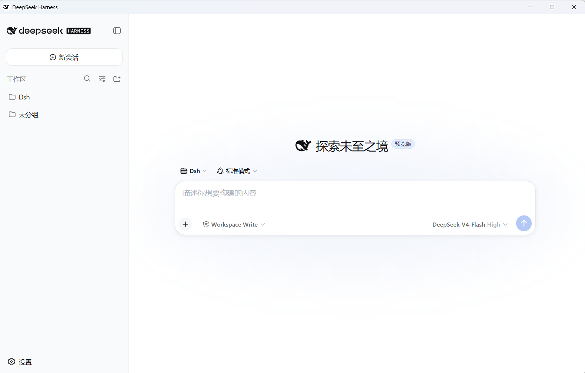
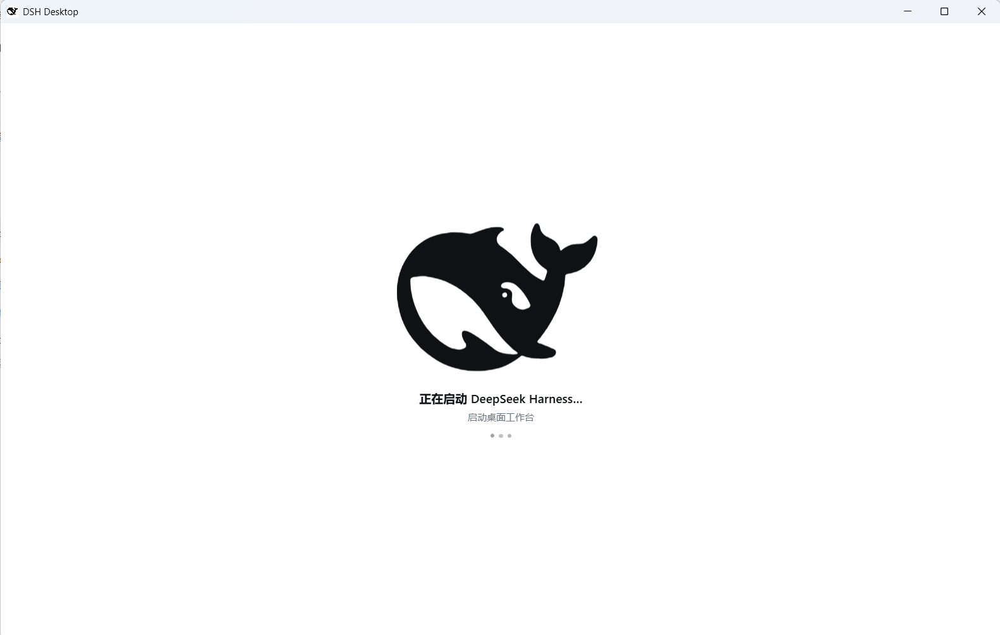
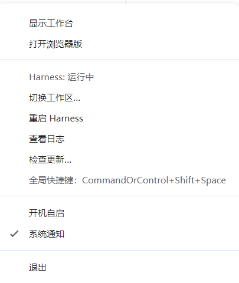

# DSH Desktop

以 [DeepSeek Harness](https://github.com/deepseek-ai/deepseek-harness) 为基底的**桌面工作台**：Electron 原生壳 + 内嵌 harness 运行时，离线、免安装 Node、免全局 dsh 即可使用。

> **自带视觉模型**：内置 `DeepSeek-V4-Flash-Vision-Exp`（`deepseek-v4-flash-vision-exp`），支持图片输入——直接把截图/图片拖进输入框，让模型看图说话、识别界面、分析图表。

---

## 设计架构

**对齐官方 [DeepSeek Harness 桌面端](https://github.com/deepseek-ai/deepseek-harness/tree/master/apps/desktop) 的运行时、插件与版本模型**：同一个绑定版本单元、同一套 profile/组合包语义、同一套官方插件系统（Web 侧边栏「插件」页 + `plugin_manager` 工具，包操作走随包 pnpm）。壳只保留桌面原生能力（窗口、托盘、深链、快捷键、通知/徽标、自动更新、局域网/浏览器版），界面是官方 Web UI 原样。

> 传输层是本壳**有意保留的差异**：官方桌面已改为「认证 Web Host（默认 19387）+ Electron 转发请求并注入」；本壳用 `dsh-app://` 特权方案直连 Host 字节管道，因此本机没有任何 harness 监听端口。逐条差距与后续对齐计划见 [docs/OFFICIAL-ALIGNMENT-REVIEW.md](docs/OFFICIAL-ALIGNMENT-REVIEW.md)。

```
Electron 壳 ──spawn(随包 Node)──▶ dsh-desktop-host（Host 子进程，进程内引导 dsh profile）
    │  ▲                              │  ▲
    │  │ fd5: Node IPC（ready/fatal/shutdown）
    │  │ fd3/fd4: 13 字节帧头的字节管道（请求/响应，64KiB 分片 + 背压）
    │  └──────────────────────────────┘
    ├── 窗口加载 dsh-app://app/ ──▶ 壳把整份 Request 交给 Host（管道 fetch）：
    │        • /api/*              → connection.createSharedFetchHandler('/api')
    │        • /.dsh/remote-stream → NDJSON 远端流（Host 注入 __DSH_TRANSPORT__）
    │        • 其余                 → 官方 Web 前端静态资源（index.html 注入传输脚本）
    └── bridge 插件 WS（127.0.0.1，随机端口 + 随机 token）→ 通知/徽标/深链/工作区注册
```

### 与官方一致的几条关键决策

| 维度 | 本壳做法（= 官方做法） |
|---|---|
| 传输 | **没有任何 harness 监听端口**。Host 在随包 Node 里引导 dsh，壳与它之间只有 fd3/fd4 字节管道（13 字节帧头、协议 v3、64 KiB 数据帧上限、按 `desiredSize` 背压）；渲染层只看到特权方案 `dsh-app://`（`shell` 壳页面 / `app` 工作台），端口、token、cookie 概念上都不存在 |
| Web UI 远端流 | 原本是 WebSocket mux（自定义方案开不了 WS）：Host 在入口文档注入 `__DSH_TRANSPORT__`（`ownsHost: true` + `openStream`），客户端改走 `/.dsh/remote-stream` 的 NDJSON；壳侧只透传 |
| 运行时 | `extraResources` 直接随包两棵树：`resources/runtime`（便携 Node + pnpm）与 `resources/dsh`（`npm install @deepseek-ai/dsh` 的完整生产闭包 + 第一方包），**不再首启解压**；`resources/dsh/desktop-runtime.json` 记录每个文件的 sha256 与发行身份（壳版本 + dsh 版本 + Node/pnpm 版本 + 协议版本），启动时校验，对不上直接拒绝启动 |
| 版本模型 | **一个签名更新单元**：壳 / dsh / Node / pnpm 由 `desktop-runtime.json` 绑死，随桌面端一起发版；不再有「单独更新 harness」的通道（历史上的整树刷新、兼容探测、tar.gz 解压与不兼容清单全部删除） |
| 插件 | **官方插件系统原样运行**：Host 向 dsh 提供官方「启动器信息」（`profileContext`，含随包 pnpm 作为 `packageManager`），`plugin-manager` 与 HMR 因此激活——侧边栏「插件」页与 `plugin_manager` 工具可在本壳里安装/启停/卸载。profile（`$DSH_HOME/profiles/dsh-workbench`）承载组合：`dsh.profile.bundles` 是有序启用列表，第一方包（bridge / host / dsh）以 **junction 共享包**链接进 profile `node_modules`，第三方插件由官方管理器用**随包 pnpm**装进 profile 依赖，事务期间持有 `<profile>/lock` 与 `desktop-packages-pending` 标记；安装失败按官方语义回滚 `package.json` + `pnpm-lock.yaml`，依赖脚本待批准时给出「允许并重试」 |
| 签名 | Windows：EV 证书 + SafeNet 令牌（`signtoolOptions.sign` → `scripts/windows-sign.mjs`，未配置签名环境时显式跳过）；macOS：Developer ID 签名 + `notarytool` 公证 + stapling（`scripts/package-macos.mjs`，`resources/dsh`/`resources/runtime` 排除签名）。逐项说明见 [docs/SIGNING.md](docs/SIGNING.md) |

### 本壳相对官方的**有意差异**

- **profile 名是 `dsh-workbench`**（官方用保留名 `desktop`）。本壳是独立应用，不占用官方保留名；首次启动会把历史 `profiles/desktop` 改名迁移。
- **多一个 `dsh-desktop-bridge` 插件**（第一方、随包、bundle 层加载）：官方壳用原生对话框/无托盘，本壳用系统通知、任务栏徽标、`dsh://` 深链、托盘、局域网/浏览器版，这些需要一条壳↔harness 的本地 RPC 通道。它是**唯一的监听 socket**（127.0.0.1 随机端口 + 每次启动随机 token），不参与 harness 的 HTTP 面。
- **局域网访问 / 浏览器版**：官方没有该能力；本壳的对外门面把 HTTP 请求喂给同一条管道 fetch，回环免授权、局域网设备需电脑确认 + 本次运行 token 换 cookie（`src/main/lanServer.ts`）。
- **会话修复与安全模式**：官方没有；本壳保留（`src/main/sessionRepair.ts`、`src/main/safeMode.ts`）。

---

## 功能截图

> 下列截图为干净示例环境所拍，无任何个人会话、路径或密钥信息。

### 主界面（会话工作台）

左侧工作区/会话树，右侧"探索未至之境"新会话入口。模型下拉可选择自身支持的能力——包括**视觉模型**（图片输入），输入框支持把图片直接拖入或点 `+` 添加。

| 主界面（新会话） |
|---|
|  |

### 加载页面（Harness 引导中的过渡页）

窗口先显示这个过渡页，随后端（内嵌 harness 组合，约 2 秒）就绪后自动切到工作台；运行时随包分发，不解压、不联网。

| 加载页面 |
|---|
|  |

### 托盘菜单

关闭窗口默认最小化到托盘；右键托盘图标可看到 Harness/桥接状态、最近会话与待审批（点击直达）、重启 Harness、API Key 自检状态、桌面插件（**在官方插件页管理** + 安全模式）、切换工作区、查看日志、重新修复旧会话日志、检查更新、开机自启、开关通知、查看全局快捷键。

> 插件管理只有一处入口：应用内左侧边栏的**「插件」页**（官方共享插件管理器）。
> 安装、启停、卸载、依赖脚本授权、pnpm 诊断都在那里；托盘不再复制一套。

| 托盘菜单 |
|---|
|  |

---

## 模型与视觉能力

桌面版接入 DeepSeek 官方 API（`baseURL` 默认 `https://api.deepseek.com`，可配置），内置模型目录（`llm-deepseek` 适配器的 `DEFAULT_MODELS`）：

| 模型 ID | 名称 | 输入模态 | 说明 |
|---|---|---|---|
| `deepseek-v4-flash` | DeepSeek-V4-Flash | 文本 | 轻量、快速 |
| `deepseek-v4-pro` | DeepSeek-V4-Pro | 文本 | 推理更充分 |
| `deepseek-v4-flash-vision-exp` | **DeepSeek-V4-Flash-Vision-Exp** | 文本 + 图片 | **视觉模型**，支持图片输入 |

### 使用视觉模型

1. 在输入框模型下拉切换到 `DeepSeek-V4-Flash-Vision-Exp`（或任意标注支持图片的模型）。
2. 把图片**拖入输入框**，或点 `+` 选择本地图片。
3. 发送后模型即可基于图片内容作答（识别界面、分析截图、读图表、生成图片描述等）。

> 若当前选中模型不支持图片，界面会提示"当前模型不支持图片，请切换支持图片的模型"——切换到视觉模型即可。

### 图片约束（视觉模型）

适配器对图片输入做了安全约束（超限会明确报错）：

| 约束 | 值 | 说明 |
|---|---|---|
| 单张图片大小 | ≤ 1 MB（`DEFAULT_REQUEST_IMAGE_MAX_BYTES`） | 超出提示"单张图片不能超过 {size}" |
| 图像像素预算 | ≤ 640,000 像素（`DEFAULT_REQUEST_IMAGE_PIXEL_BUDGET`） | 超出提示"图片分辨率过大，请压缩后重试" |
| 每条消息图片数 | 有上限（各模型可配，界面提示"一条消息最多添加 {count} 张"） | — |
| 请求总体积 | ≤ 128 MB（`DEFAULT_MAX_REQUEST_FILES_BYTES`） | — |
| 支持格式 | PNG / JPG / WebP / GIF | 不支持的类型提示"仅支持 PNG、JPG、WebP、GIF" |

> 图片按"附加内容块"（attachment）经 harness 的图片预检（`inputModalities` 能力门控）后才进入请求；模型不支持图片时会在预检阶段直接拒绝，不消耗调用。

---

## 安装

1. 从 [Releases](https://github.com/Plocr/dsh-desktop/releases) 下载最新安装包（Windows：`DSH.Desktop-x.x.x-setup.exe`）
2. 双击运行，按向导完成安装（可选择安装目录）
3. 首次启动创建桌面 profile 并引导内嵌 harness（约 2 秒，无需解压、无需联网）

> 安装包自包含：内置便携 Node 与 dsh 运行时，**无需**预先安装 Node.js 或全局 dsh。

---

## 使用

- **开始会话**：启动后在窗口内选择工作区，即可开始对话
- **视觉模型**：模型下拉切换到 `DeepSeek-V4-Flash-Vision-Exp`，拖入图片即可看图对话（见上方"模型与视觉能力"）
- **全局唤出**：任意界面按 `Ctrl+Shift+Space` 呼出/隐藏窗口
- **深链**：浏览器或其他应用点击 `dsh://` 链接可唤起并打开对应会话
- **托盘**：关闭窗口默认最小化到托盘；右键托盘图标可看 Harness/桥接状态、最近会话与待审批（点击直达）、切换工作区、重启 Harness、查看日志、检查更新、开机自启、开关通知
- **会话共享**：桌面版默认使用**独立数据目录**（`%LOCALAPPDATA%/DSH Desktop/dsh-home`），并与 Web/CLI 并存互不冲突；首次启动会自动把旧的 `~/.dsh` 迁移过去，原数据保留。
- **局域网访问**（托盘 → 设置 → 局域网访问）：不改 harness 监听（本机 `127.0.0.1` 始终可用），由壳起一个**局域网反向代理**（绑 `0.0.0.0:<随机端口>`，转发到本机 harness）并显示「局域网地址」。手机/其它设备首次访问该地址时，**电脑会弹授权框**（按设备 IP 记一次，本次运行有效）：允许才放行，拒绝返回 403。⚠️ 允许后该设备可在浏览器中操作本工作台（可读文件/执行命令），建议仅在可信网络使用，用毕关闭。

---

## 隐私说明

- **数据本地化**：会话、工作区、设置均保存在本机（默认 `%LOCALAPPDATA%/DSH Desktop/dsh-home` 下的独立数据目录），不与 Web/CLI 冲突，也不会自动上传。
- **API 凭据**：DeepSeek API Key 通过配置的凭据存储（或在环境变量 `DEEPSEEK_API_KEY`）提供给 harness，仅在发起模型请求时使用；桌面壳本身不保存密钥明文到会话。
- **网络边界**：默认仅回环监听（`127.0.0.1`）；局域网访问需显式开启（托盘 → 设置 → 局域网访问），且首次访问需本机授权。关闭后立即停止对外代理。
- **更新元数据**：更新检查只访问 npm registry / GitHub Releases 拉取版本与安装包，不包含你的会话内容。
- **截图示例**：本仓库 `docs/screenshots` 的界面截图为干净示例环境拍摄，经确认不含个人会话正文、本地路径或密钥。

---

## 更新机制

**一条链路：框架更新（本应用）**，它同时带走随包运行时。术语：**框架** = DSH Desktop 本体；**官方 Harness** = DeepSeek Harness（`@deepseek-ai/dsh`）。

- 源：GitHub Releases（[Plocr/dsh-desktop](https://github.com/Plocr/dsh-desktop/releases)）
- **本地下载，不跳浏览器**：electron-updater `autoDownload`；下载全程右上角卡片实时进度 + 任务栏进度条
- **下载完成 → 点「安装更新并重启」按钮（或系统通知）→ 确认后退出并安装**，安装完自动重启；
  若下载完没点安装就退出，下次启动仍会重新提示（跨重启保留，不会丢）
- 通知内附两个下载地址：GitHub 官方地址 + **免费加速代理地址**（默认 `ghfast.top`，可用环境变量 `DSH_DESKTOP_GH_PROXY` 覆盖）

> **为什么没有"单独更新官方 Harness"的通道**：壳版本 + dsh 版本 + 便携 Node + pnpm + Host 协议版本被打包成一个
> **签名更新单元**，写进随包 `resources/dsh/desktop-runtime.json`（逐文件 sha256），启动时校验；对不上直接拒绝启动。
> 历史版本里那套「应用内检测 npm 版本 → 整树替换 → 兼容性闸门 → 不兼容清单」已全部移除。
> 这么做换来的是：不存在"壳与运行时半新半旧"的组合，任何一方的行为差异都不会变成用户侧的偶发故障；
> 代价是 harness 只能跟着框架一起升级（要更新的 dsh 请等框架发版）。
> 相关环境变量（仅打包时用，见 `scripts/setup-runtime.mjs`）：`DSH_RUNTIME_DSH_VERSION`（默认 npm 上最新的可用版）、
> `DSH_RUNTIME_NODE_VERSION`、`DSH_RUNTIME_NODE_ARCH`。

**入口只有两个（托盘 → 设置）：**

- `自动更新（框架 v… · 官方 Harness v…）`（开关，默认开）：冷启动自动检查并下载一次；关闭则仅手动
- `检查并更新…`（动作）：检查框架更新，有新版自动本地下载；下载完成后需点「安装更新」按钮确认安装

**托盘状态行（排障用）：**

- `Harness: running（N 个任务运行中）`：Host 进程状态 + 后台任务数
- `桥接：已连接 · jobs present`：壳 ↔ harness 的桥接通道状态（插件 `bridge.diag` 上报）；
  显示 `未连接`、`jobs 不可用`、`⚠ 协议不匹配` 时，通知/徽标/深链会相应降级，日志里有 `bridge diag(...)` 明细
- `待审批：N 条（点击查看）`：有审批等待处理时出现，点击直达该会话（同一份提醒也发系统通知）
- `最近会话`：最近会话列表（新→旧，最多 8 条），点击直达；改动即时生效（`sessions.changed` 增量推送）

## 开发 / 构建

前置：Node ≥ 22。以下命令均在仓库根目录执行。

```bash
npm install            # 安装开发依赖（shell 侧；运行时依赖由 setup:runtime 单独安装）
npm run dev            # 开发模式（隔离 userData，与已安装版并行）
npm run check          # typecheck + 单测（npm run typecheck && npm test）
npm test               # 单元测试
```

**构建安装包**（运行时自包含，首次构建会下载便携 Node 并安装 450+ 依赖，耗时较长）：

```bash
npm run dist:win          # Windows NSIS 安装包（主平台，实测）
npm run dist:win:portable # Windows 便携版
npm run dist:mac          # macOS dmg（需在 macOS 上执行，arm64/x64）
```

- `scripts/build.mjs`：esbuild 打包 main/preload → `dist/`
- `scripts/make-icons.mjs`：生成应用图标（png / ico / icns）
- `scripts/setup-runtime.mjs`：构建随包运行时两棵树——`resources/runtime`（便携 Node + pnpm）与 `resources/dsh`（`npm install @deepseek-ai/dsh` + 第一方包 tgz + `desktop-runtime.json` 逐文件 sha256 清单）；源码哈希未变时秒过不联网
  - 可用环境变量：`DSH_RUNTIME_DSH_VERSION`（默认取 `package.json` 的 `dshRuntime.dsh`，当前 `0.1.6-alpha.2`——与官方桌面端同版；本壳 profile 为自有名 `dsh-workbench`，不受官方 desktop 守卫影响）、`DSH_RUNTIME_NODE_VERSION`（默认 `v24.15.0`）、`DSH_RUNTIME_NODE_ARCH`（目标便携 Node 架构，交叉构建时显式指定）
  - **载荷策略**：`DSH_DESKTOP_OFFICE_RUNTIME=1` 才把 Office→PDF 原生引擎（LibreOffice，win32-x64 ≈ 325 MB / 2050 文件）打进包——默认不带，安装包因此小 ~80 MB、装机文件少数千个；代价是应用内 docx/xlsx/pptx 预览不可用（第一次转换会以 `unavailable` 明确报错）。文档类 `.md`（保留 LICENSE/NOTICE）与便携 Node 自带的 npm 目录也在打包时剔除。
- `scripts/merge-mac-manifest.mjs`：合并 macOS arm64/x64 两个 `latest-mac.yml` 为一份（多架构自动更新）

CI（`.github/workflows/build-release.yml`）：master/PR 跑 `check`（typecheck + 单测）与 `e2e`（Windows：真实 dsh 运行时 + Host 管道 + 桥接契约，`npm run e2e:bridge`）；打 `v*` tag 或手动触发时跑三平台安装包构建并上传到对应 Release。mac 的 arm64 构建在 x64 runner 上交叉进行，便携 Node 目标架构经 `DSH_RUNTIME_NODE_ARCH` 显式指定。

---

## 平台支持

- **Windows**（主平台，实测）：NSIS 安装包、托盘、系统通知、任务栏徽标、开机自启、`dsh://` 深链
- **macOS**（配置就绪）：dmg（arm64/x64）、`dsh://` 深链、运行时路径走 `~/Library/Application Support`
- **Linux**：代码兼容，未提供安装包

---

## License

MIT
